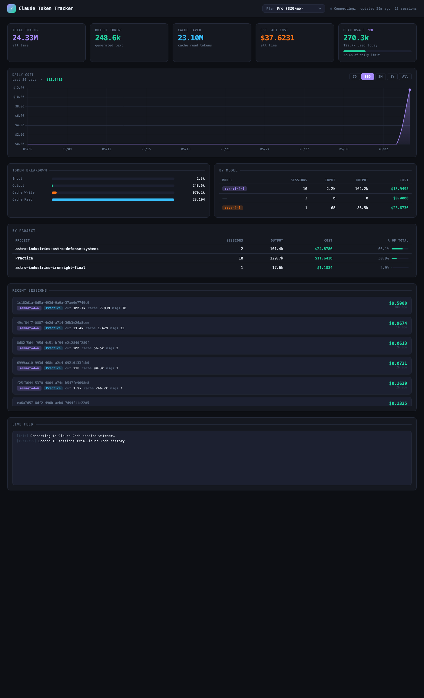

# ⚡ Claude Token Tracker

A live dashboard that tracks your **Claude Code** token usage and estimated cost in real time. It reads the session files Claude Code writes to `~/.claude/projects/`, parses the token usage from every message, and streams updates to a browser dashboard the moment a new response is written.



> **Note:** This runs **locally on your own machine** and shows **your own** Claude Code usage. It is not a hosted website — each person who runs it sees their own data.

## Features

- **Live updates** — the dashboard refreshes automatically every time Claude Code responds (no page reload)
- **KPI cards** — total tokens, output tokens, cache savings, estimated API cost
- **Daily cost chart** — selectable date ranges (7D / 30D / 3M / 1Y / All)
- **Plan usage** — pick your Claude plan (Free / Pro / Max) to see estimated tokens remaining today
- **Per-model breakdown** — cost split across Sonnet / Opus / Haiku
- **Per-project breakdown** — which projects consumed the most tokens
- **Recent sessions** + a **live activity feed**

## Requirements

- [Node.js](https://nodejs.org/) 16 or newer
- [Claude Code](https://docs.claude.com/claude-code) installed and used at least once (so there's session data to read)

## Setup

```bash
# 1. Clone the repo
git clone https://github.com/<your-username>/claude-token-tracker.git
cd claude-token-tracker

# 2. Install dependencies
npm install

# 3. Start the server
npm start
```

Then open **http://localhost:3737** in your browser.

## How It Works

```
Claude Code writes to → ~/.claude/projects/*.jsonl
                                  ↓
              server.js watches those files (chokidar)
                                  ↓
            parses token usage from each message
                                  ↓
          pushes updates to the browser via SSE
                                  ↓
              index.html renders the live dashboard
```

| File | Purpose |
|------|---------|
| `server.js` | Express server — scans session files, calculates cost, watches for changes, pushes live updates |
| `public/index.html` | The dashboard UI (Chart.js + vanilla JS) |

## Key Concepts

- **JSONL** — JSON Lines, one JSON object per line. Claude Code appends one per message.
- **SSE (Server-Sent Events)** — a one-way live stream from server → browser. Simpler than WebSockets for a read-only dashboard.
- **chokidar** — watches the filesystem and fires an event whenever a session file changes.
- **Deduplication** — Claude Code writes the same response to multiple nodes in the conversation tree, so we track message IDs to avoid double-counting tokens.

## Notes & Limitations

- **Cost is an estimate** based on public Anthropic API pricing. If you're on a flat-rate plan (Pro/Max), this shows what the usage *would* cost on the API — not your actual bill.
- **Plan limits are community estimates** — Anthropic doesn't publish exact daily token caps.
- Only reads what's currently in `~/.claude/projects/` on this machine.

## License

MIT — free to use and modify.
